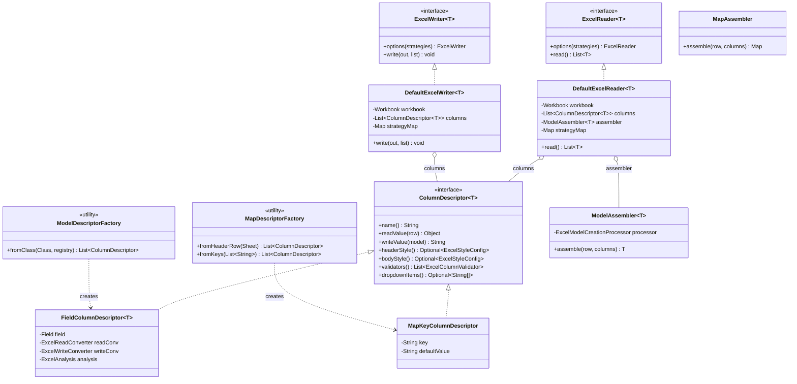

# Option A — ColumnDescriptor + Composition

> **요약**: `AbstractExcelReader/Writer` 추상 클래스를 폐기하고, 단일 구상 reader/writer 가 `List<ColumnDescriptor<T>>` 를 받아 동작하도록 변경.
> Model 과 Map 의 차이는 **클래스 계층** 이 아니라 **descriptor 빌더(factory)** 로 표현.

---

## 1. 동기 — 현재 구조의 무엇을 해결하는가

| # | 현재 문제                                                                  | 위치                                                              |
|---|------------------------------------------------------------------------|-----------------------------------------------------------------|
| 1 | `MAP_TYPE = Class.forName("java.util.Map")` 위장                         | `MapReader.java:40-52`, `MapWriter.java:57-77`                  |
| 2 | `BodyStyles/HeaderStyles/Filter` 처리가 두 writer 에 거의 동일하게 복사됨 (~150 LOC) | `ModelWriter.java:176-324` ↔ `MapWriter.java:151-204`           |
| 3 | `modelType` 이 Map 모드에서 무의미하게 보유됨                                       | `AbstractExcelReader.java:88-89`                                |
| 4 | `readBodyAsMaps()` 가 leaky abstraction (`Map<String,String>` 중간형식 노출)  | `AbstractExcelReader.java:215-232`                              |
| 5 | 추상이 strategy 전용 상태 보유 (`columnWidths`, `formulaEvaluator`, `limit`)    | `AbstractExcelWriter.java:76`, `AbstractExcelReader.java:78,83` |

핵심 진단: **추상이 그어야 할 경계는 "Model 이냐 Map 이냐" 가 아니라 "이 컬럼은 무엇을 읽고/쓰는가" 였다.** 컬럼 단위를 1급 추상화로 끌어올리면 Model/Map 분기 자체가 의미를 잃습니다.

---

## 2. 핵심 아이디어 (한 줄)

> *"엑셀 컬럼"은 클래스가 아니라 데이터다.*  `ColumnDescriptor<T>` 가 컬럼 하나의 read/write/스타일/검증을 캡슐화하면, reader/writer 는 descriptor 리스트를
> 순회하는 단순 엔진이 된다.

---

## 3. 아키텍처 도표

### 3-1. 책임 분리 (Before vs After)

```
[BEFORE]                              [AFTER]
                                      
  Javaxcel                              Javaxcel
    ├─ Model 분기                          ├─ ModelDescriptorFactory.from(Class)
    │   └─ ModelReader/Writer              │       ↓
    │       └─ AbstractExcelReader/Writer  │   List<ColumnDescriptor<T>>
    └─ Map 분기                            │       ↓
        └─ MapReader/Writer            ┌──────────────┐
            └─ AbstractExcelReader/Writer│DefaultExcel │  ← 단일 엔진
                                        │Reader/Writer│
                                        └──────────────┘
                                            ↑
                                        Map 분기:
                                            └─ MapDescriptorFactory.fromKeys / sheetHeader
```

### 3-2. 흐름도 (write 경로)

```
┌─────────────────────────────────────────────────────────────┐
│ Javaxcel.writer(wb, MyDto.class)                            │
└────────────┬────────────────────────────────────────────────┘
             ↓
┌─────────────────────────────────────────────────────────────┐
│ ModelDescriptorFactory.fromClass(MyDto.class, registry)     │
│   • FieldUtils.getTargetedFields()                          │
│   • ExcelWriteAnalyzer.analyze() (현재 로직 그대로 재사용)    │
│   • Field/Annotation → FieldColumnDescriptor 인스턴스화     │
└────────────┬────────────────────────────────────────────────┘
             ↓
        List<ColumnDescriptor<MyDto>>
             ↓
┌─────────────────────────────────────────────────────────────┐
│ new DefaultExcelWriter<>(wb, columns)                       │
│   .options(new BodyStyles(...), new Filter(true), ...)      │
│   .write(out, list)                                         │
└────────────┬────────────────────────────────────────────────┘
             ↓
┌─────────────────────────────────────────────────────────────┐
│ SheetIO 가 columns 만 보고 시트 작성                         │
│   BodyStyles 는 columns.size() 만 사용 (fields/keys 모름)   │
│   HeaderStyles 는 col.headerStyle() 만 호출                 │
│   EnumDropdown 은 col.dropdownItems() 만 확인               │
└─────────────────────────────────────────────────────────────┘
```

---

## 4. 클래스 다이어그램



핵심 변화:

- `AbstractExcelReader/Writer` **삭제** — 추상 계층 자체가 사라짐.
- `ModelReader/MapReader/ModelWriter/MapWriter` **삭제** — factory 로 흡수.
- `ColumnDescriptor<T>` 가 **유일한 다형성 축**.

---

## 5. 패키지 구조

```
core/src/main/java/com/github/javaxcel/core/
├── Javaxcel.java                              ⚙ 변경 — facade 만 새 경로 호출
├── annotation/                                ⚪ 불변
├── converter/                                 ⚪ 불변
│   ├── handler/...
│   └── handler/registry/...
├── in/
│   ├── ExcelReader.java                       ⚪ 불변 (인터페이스 그대로)
│   ├── DefaultExcelReader.java                ➕ 신규 — 유일한 구상
│   ├── ColumnDescriptor.java                  ➕ 신규 — 1급 추상
│   ├── descriptor/
│   │   ├── ModelDescriptorFactory.java        ➕ 신규
│   │   ├── MapDescriptorFactory.java          ➕ 신규
│   │   ├── FieldColumnDescriptor.java         ➕ 신규 (현 ModelReader 의 변환 로직)
│   │   └── MapKeyColumnDescriptor.java        ➕ 신규
│   ├── assembler/
│   │   ├── ModelAssembler.java                ➕ 신규 (현 ExcelModelCreationProcessor 어댑터)
│   │   └── MapAssembler.java                  ➕ 신규 (passthrough)
│   ├── strategy/                              ⚪ 불변
│   ├── lifecycle/                             ❌ 삭제 또는 단순화
│   ├── context/ExcelReadContext.java          ⚙ 변경 — list/sheet/chunk 만 보유
│   └── core/                                  ❌ 디렉토리 삭제 (Abstract*, Model*, Map*)
└── out/                                       (대칭 구조)
    ├── ExcelWriter.java                       ⚪
    ├── DefaultExcelWriter.java                ➕
    ├── ColumnDescriptor.java                  (in 과 동일 인터페이스 재사용 또는 직교 분리)
    ├── descriptor/                            ➕
    ├── strategy/                              ⚪
    ├── context/ExcelWriteContext.java         ⚙
    └── core/                                  ❌
```

---

## 6. 핵심 코드 스케치

### 6-1. ColumnDescriptor 인터페이스

```java
public interface ColumnDescriptor<T> {
    String name();                                       // 헤더 노출용

    @Nullable
    Object readValue(Map<String, String> row); // read path

    @Nullable
    String writeValue(T model);                // write path

    default Optional<ExcelStyleConfig> headerStyle() {
        return Optional.empty();
    }

    default Optional<ExcelStyleConfig> bodyStyle() {
        return Optional.empty();
    }

    default List<ExcelColumnValidator> validators() {
        return Collections.emptyList();
    }

    default Optional<String[]> dropdownItems() {
        return Optional.empty();
    }
}
```

### 6-2. DefaultExcelReader (현 `AbstractExcelReader` ~330 LOC → ~100 LOC)

```java
public final class DefaultExcelReader<T> implements ExcelReader<T> {
    private final Workbook workbook;
    private final List<ColumnDescriptor<T>> columns;
    private final ModelAssembler<T> assembler;
    private Map<Class<? extends ExcelReadStrategy>, ExcelReadStrategy> strategies =
            Collections.emptyMap();

    @Override
    public final ExcelReader<T> options(ExcelReadStrategy... s) {
        this.strategies = StrategyDedup.collect(s);  // 중복 제거 헬퍼 (BLOCKER #3 해결)
        return this;
    }

    @Override
    public List<T> read() {
        int limit = StrategyResolver.limit(strategies).orElse(-1);
        List<T> all = new ArrayList<>();
        for (Sheet sheet : ExcelUtils.getSheets(workbook)) {
            if (all.size() == limit)
                break;
            for (Map<String, String> row : SheetIO.dataRows(sheet, columns, formulaEvaluator)) {
                if (all.size() == limit)
                    break;
                all.add(assembler.assemble(row, columns));
            }
        }
        return all;
    }
}
```

### 6-3. ModelDescriptorFactory

```java
public final class ModelDescriptorFactory {
    public static <T> List<ColumnDescriptor<T>> fromClass(
            Class<T> type, ExcelTypeHandlerRegistry registry) {
        List<Field> fields = FieldUtils.getTargetedFields(type);
        Asserts.that(fields)
                .describedAs("ModelDescriptorFactory.fields cannot be empty: {0}", type.getName())
                .isNotEmpty();
        fields.forEach(AccessibleObject::trySetAccessible);

        ExcelAnalyzer ra = new ExcelReadAnalyzer(registry);
        List<ExcelAnalysis> analyses = ra.analyze(fields, /* strategies provided later */ new Object[0]);

        return IntStream.range(0, fields.size())
                .mapToObj(i -> new FieldColumnDescriptor<T>(fields.get(i), analyses.get(i), registry))
                .collect(Collectors.toUnmodifiableList());
    }
}
```

### 6-4. Strategy 가 fields/keys 를 모르게 됨 (중복 소멸의 핵심)

```java
// 현재 (ModelWriter.resolveBodyStyles + MapWriter.setBodyStyles 거의 동일 — 150 LOC 중복)
ExcelStyleConfig[] bodyConfigs = bodyStyleConfigs.toArray(new ExcelStyleConfig[0]);
// + ExcelModel/ExcelColumn 어노테이션 기반 fallback (ModelWriter 만)
// + size assertion: "fields.size: {1}" 또는 "keys.size: {1}"

// 변경 후 (BodyStyles 자체가 columns 만 알면 됨)
public Object execute(ExcelWriteContext<?> ctx) {
    List<ExcelStyleConfig> configs = this.configs;
    int columnCount = ctx.getColumns().size();          // ← 단일 source of truth
    Asserts.that(configs)
            .describedAs("BodyStyles.size must be 1 or {0}", columnCount)
            .is(c -> c.size() == 1 || c.size() == columnCount);
    return ExcelUtils.toCellStyles(ctx.getWorkbook(),
            configs.toArray(new ExcelStyleConfig[0]));
}
```

---

## 7. 마이그레이션 단계

### Phase 1 — 안전한 사전 작업 (behavior 동일, 0 risk)

1. `ColumnDescriptor<T>` 인터페이스 도입 (`internal/`).
2. `internal/converter/{in,out}/support/` 의 변환 로직을 descriptor 가 호출 가능한 단위 메서드로 정리.

### Phase 2 — Model 경로 마이그레이션

3. `FieldColumnDescriptor<T>` 작성: `ExcelReadConverters.convert(field, maps)` /
   `ExcelWriteConverters.convert(field, model)` 위임.
4. `ModelDescriptorFactory` 작성: 현 `ModelReader.constructor` / `ModelWriter.constructor` 의 fields/registry/analyses 초기화
   흡수.
5. `DefaultExcelReader/Writer` 작성: 현 `AbstractExcelReader.read()` / `AbstractExcelWriter.write()` 의 sheet 순회 흡수.
6. `Javaxcel.reader(wb, type)` / `writer(wb, type)` 가 새 경로 호출. **기존 클래스 보존** — 사용자 코드 깨지지 않음.
7. 회귀 테스트(Spock 65개 + JUnit 23개) 전부 통과 확인.

### Phase 3 — Map 경로 마이그레이션

8. `MapKeyColumnDescriptor` + `MapDescriptorFactory` 작성. read 시점은 sheet 첫 행에서 동적 생성.
9. `Javaxcel.reader(wb)` / `writer(wb)` 가 새 경로 호출.
10. `ModelReader/MapReader/ModelWriter/MapWriter`, `AbstractExcelReader/Writer` 삭제. `MAP_TYPE` 제거.

### Phase 4 — Strategy 정리

11. `BodyStyles`, `HeaderStyles`, `Filter` 의 Model/Map 중복 로직 제거 (descriptor 가 단일 source 이므로 한 곳).
12. `EnumDropdown` 도 descriptor 의 `dropdownItems()` 로 일원화.

---

## 8. Tradeoffs

| 측면                          | 평가                                                                                         |
|-----------------------------|--------------------------------------------------------------------------------------------|
| **공통 골격 추출**                | ✅ Model/Map 분기 자체가 사라짐                                                                     |
| **strategy 중복**             | ✅ `BodyStyles/HeaderStyles/Filter` 자동 단일화 (~150 LOC 제거)                                    |
| **`MAP_TYPE` 위장**           | ✅ 제거                                                                                       |
| **public API 호환성**          | ✅ `Javaxcel`, `ExcelReader`, `ExcelWriter` 인터페이스 불변                                        |
| **internal API 호환성**        | ❌ `Abstract*` 를 직접 상속하던 외부 코드는 깨짐 (있다고 가정 시)                                               |
| **descriptor 인터페이스 비대화 위험** | ⚠ enum-dropdown / SpEL / validators / styles 모두 들어감 → ISP 재발 위험. 기본 메서드 + Optional 로 완화 가능 |
| **마이그레이션 비용**               | 🔴 셋 중 가장 높음. 모든 `internal/converter` 경로 손봐야 함                                             |
| **장기 유지보수성**                | ✅ 새 컬럼 타입(예: 동적 컬럼, 가상 컬럼) 도입이 단순                                                          |

---

## 9. 권장 도입 시기

- **지금 도입하지 말 것**: 단계가 4개나 되고 cross-cutting. 다른 우선 작업 중이면 비추천.
- **다음 메이저(0.10 또는 1.0)에 추천**: API 재정비 시점에 함께. 이때 `ColumnDescriptor` 를 internal 로 둘지 public extension point 로 둘지 결정.
- **부분 도입은 비추천**: descriptor 와 추상 클래스가 공존하면 결합 두 배.
- **선행 단계로 [Option B](option-b-stage-pipeline.md) 추천**: stage pipeline 으로 라이프사이클을 데이터화한 뒤, stage 들의 `execute()` 를
  descriptor 호출로 대체하면 점진적 마이그레이션이 가능. [Option C](option-c-sheet-engine.md) 와는 사실상 같은 방향의 다른 단면 — `RowSink<T>` 가
  `List<ColumnDescriptor>` 를 보유하는 형태로 결합 가능.

---

## 10. 한 줄 결론

> **가장 깨끗한 답이지만 가장 비싼 답.** API 재정비 시점에 한꺼번에 도입할 가치가 있다. 그 전까지는 [Option B](option-b-stage-pipeline.md) 가 현실적.
