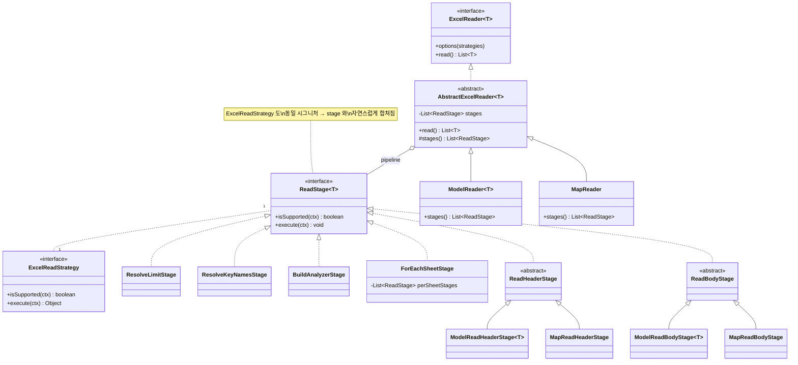

# Option B — Stage Pipeline

> **요약**: 추상 클래스의 `read()/write()` 라이프사이클을 **명시적 stage 리스트**로 변환. 각 stage 는 `isSupported(ctx) + execute(ctx)` 시그니처(이미
`ExcelReadStrategy/ExcelWriteStrategy` 와 동일)를 가지며, 추상의 본문은 단순 dispatcher 가 됨. 클래스 계층은 그대로 유지.

---

## 1. 동기 — 현재 구조의 무엇을 해결하는가

| # | 현재 문제                                                                                                     | 위치                                                                       |
|---|-----------------------------------------------------------------------------------------------------------|--------------------------------------------------------------------------|
| 1 | 라이프사이클 순서가 코드에 암묵적으로 박혀 있음 (어디서 어떤 strategy 가 해석되는지 추적 어려움)                                               | `AbstractExcelReader.java:145-187`, `AbstractExcelWriter.java:128-187`   |
| 2 | strategy 처리가 추상/구상 두 레이어에 흩어짐 (`Limit`,`KeyNames`,`AutoResize`는 추상; `BodyStyles`,`Filter`,`Parallel`은 구상) | 위 파일들 + `ModelReader.java:107-146`, `ModelWriter.java:118-324`           |
| 3 | reader 는 `prepare` 전에 일부 strategy 해석, writer 는 `prepare` 후에 해석 — 비대칭이며 문서화 안 됨                            | `AbstractExcelReader.java:151-155` vs `AbstractExcelWriter.java:134-136` |
| 4 | `BodyStyles/HeaderStyles/Filter` 가 `ModelWriter`/`MapWriter` 양쪽에 중복                                       | `ModelWriter.java:176-324` ↔ `MapWriter.java:151-204`                    |

핵심 진단: **라이프사이클은 이미 stage 들의 시퀀스다. 다만 코드에 인라인되어 있을 뿐**. 명시적 stage 리스트로 빼내면 (a) 순서 추적이 쉬워지고, (b) 추상/구상의 stage 를 같은 리스트에
자연스럽게 합칠 수 있고, (c) 새 strategy 추가가 "stage 추가"로 단순해짐.

핵심 통찰: `ExcelReadStrategy/ExcelWriteStrategy` 인터페이스가 이미 `isSupported + execute` 모양 — **80% 가 이미 stage 다.** 남은 일은 라이프사이클
인라인 로직을 stage 로 추출하고 dispatcher 로 묶는 것.

---

## 2. 핵심 아이디어 (한 줄)

> *라이프사이클을 데이터로.* 추상의 인라인 로직을 `Stage` 객체 시퀀스로 바꾸면, 추상은 dispatcher 가 되고 strategy 는 stage 가 된다.

---

## 3. 아키텍처 도표

### 3-1. 책임 변화 (Before vs After)

```
[BEFORE]                                  [AFTER]
                                         
read() {                                  read() {
  setList(list)                             for (stage : stages) {
  resolveLimit()        ← Limit              if (stage.isSupported(ctx))
  resolveHeaderNames()  ← KeyNames              stage.execute(ctx)
  prepare(ctx)          ← lifecycle hook    }
  for (sheet : sheets) {                  }
    preReadSheet(ctx)
    if (headerNames.empty)
        readHeader(ctx)                   stages = [
    chunk = readBody(ctx)                   ResolveLimitStage,
    list.addAll(chunk)                      ResolveKeyNamesStage,
    postReadSheet(ctx)                      BuildAnalyzerStage,    ← 현 prepare
  }                                         ForEachSheet(
  complete(ctx)                              [PreReadSheetStage,
}                                             ReadHeaderStage,
                                              ReadBodyStage,
                                              PostReadSheetStage]),
                                            CompleteStage
                                          ]
```

### 3-2. Stage 흐름도 (read 경로)

```
ExcelReadPipeline.run(ctx)
  │
  ├─[1] ResolveLimitStage           ← Limit strategy 가 있으면 ctx.limit 설정
  ├─[2] ResolveKeyNamesStage        ← KeyNames strategy 가 있으면 ctx.headerNames 설정
  ├─[3] BuildAnalyzerStage          ← (Model 모드만 isSupported=true) analyzer/converter/validator 구축
  │       └─ NoOp on Map 모드
  │
  ├─[4] ForEachSheetStage(loop)
  │       │
  │       ├─[4a] PreReadSheetStage
  │       ├─[4b] ReadHeaderStage     ← (모드별 분기) FieldUtils.toHeaderNames vs sheet[0]
  │       ├─[4c] ReadBodyStage       ← (모드별 분기) ModelRowAssembler vs identity
  │       └─[4d] PostReadSheetStage
  │
  └─[5] CompleteStage
```

각 stage 는 독립적이며, **순서가 명시적인 데이터** 다.

---

## 4. 클래스 다이어그램



핵심:

- `AbstractExcelReader` **유지**, 본문이 dispatcher 로 단순화.
- `ReadStage` 와 `ExcelReadStrategy` 는 **같은 시그니처** — 결과적으로 strategy 가 곧 stage.
- 모드별 분기는 `stages()` 메서드 한 곳에서.

---

## 5. 패키지 구조

```
core/src/main/java/com/github/javaxcel/core/
├── Javaxcel.java                              ⚪ 불변
├── annotation/                                ⚪ 불변
├── converter/                                 ⚪ 불변
├── in/
│   ├── ExcelReader.java                       ⚪ 불변
│   ├── core/
│   │   ├── AbstractExcelReader.java           ⚙ 변경 — dispatcher 로 축소 (~50 LOC)
│   │   └── impl/
│   │       ├── ModelReader.java               ⚙ 변경 — stages() 만 정의
│   │       └── MapReader.java                 ⚙ 변경 — stages() 만 정의
│   ├── pipeline/                              ➕ 신규 디렉토리
│   │   ├── ReadStage.java                     ➕ 신규 (interface)
│   │   ├── ReadPipeline.java                  ➕ 신규 (executor)
│   │   ├── stages/
│   │   │   ├── ResolveLimitStage.java         ➕ 현 resolveLimit() 추출
│   │   │   ├── ResolveKeyNamesStage.java      ➕ 현 resolveHeaderNames() 추출
│   │   │   ├── BuildModelAnalyzerStage.java   ➕ 현 ModelReader.prepare() 추출
│   │   │   ├── ForEachSheetStage.java         ➕ 현 read() 의 for-loop 추출
│   │   │   ├── ReadHeaderStage.java           ➕ abstract
│   │   │   ├── ReadBodyStage.java             ➕ abstract
│   │   │   ├── ModelReadHeaderStage.java      ➕
│   │   │   ├── ModelReadBodyStage.java        ➕ (Parallel strategy 지원)
│   │   │   ├── MapReadHeaderStage.java        ➕
│   │   │   └── MapReadBodyStage.java          ➕
│   ├── strategy/                              ⚙ 변경 — strategy 일부가 stage 로 마이그레이션
│   ├── lifecycle/                             ❌ 삭제 (stage 가 대체)
│   └── context/ExcelReadContext.java          ⚪ 불변
└── out/                                       (대칭 구조)
    ├── core/AbstractExcelWriter.java          ⚙
    ├── pipeline/                              ➕
    │   ├── WriteStage.java
    │   ├── WritePipeline.java
    │   └── stages/
    │       ├── PartitionByMaxRowsStage.java   (현 chunkedList 로직)
    │       ├── ResolveSheetNamesStage.java    (현 createSheetNames)
    │       ├── ForEachSheetStage.java
    │       ├── CreateHeaderStage.java         (모드별)
    │       ├── CreateBodyStage.java           (모드별)
    │       ├── ResolveHeaderStylesStage.java  ⭐ Model/Map 통합 (중복 제거)
    │       ├── ResolveBodyStylesStage.java    ⭐ Model/Map 통합
    │       ├── ResolveFilterStage.java        ⭐ Model/Map 통합
    │       ├── ResolveAutoResizeStage.java
    │       ├── ResolveHiddenExtraStage.java
    │       ├── SaveStage.java
    │       └── CloseResourceStage.java
    └── lifecycle/                             ❌ 삭제
```

---

## 6. 핵심 코드 스케치

### 6-1. ReadStage 인터페이스

```java
public interface ReadStage<T> {
    /** 이 stage 가 현재 컨텍스트에 적용 가능한지 (e.g. strategy 가 등록되어 있는지) */
    default boolean isSupported(ExcelReadContext<T> ctx) {
        return true;
    }

    /** stage 실행 — context 변이가 허용됨 */
    void execute(ExcelReadContext<T> ctx);

    /** stage 식별자 (디버깅/로깅용) */
    default String stageId() {
        return getClass().getSimpleName();
    }
}
```

### 6-2. AbstractExcelReader (현 ~330 LOC → ~60 LOC)

```java
public abstract class AbstractExcelReader<T> implements ExcelReader<T> {
    private final ExcelReadContext<T> context;
    private Map<Class<? extends ExcelReadStrategy>, ExcelReadStrategy> strategies =
            Collections.emptyMap();

    @Override
    public final ExcelReader<T> options(ExcelReadStrategy... s) {
        this.strategies = StrategyDedup.collect(s, context);
        context.setStrategyMap(this.strategies);
        return this;
    }

    @Override
    public final List<T> read() {
        ReadPipeline.run(stages(), context);
        return context.getList();
    }

    /** 서브클래스가 자신의 stage 시퀀스를 정의 */
    protected abstract List<ReadStage<T>> stages();
}
```

### 6-3. ModelReader (현 ~170 LOC → ~50 LOC)

```java
public class ModelReader<T> extends AbstractExcelReader<T> {
    private final ModelMeta<T> meta;   // fields + registry + assembler

    public ModelReader(Workbook wb, Class<T> type, ExcelTypeHandlerRegistry reg) {
        super(wb, type);
        this.meta = ModelMeta.of(type, reg);
    }

    @Override
    protected List<ReadStage<T>> stages() {
        return List.of(
                new ResolveLimitStage<>(),
                new ResolveKeyNamesStage<>(),
                new BuildModelAnalyzerStage<>(meta),         // 현 prepare()
                new ForEachSheetStage<>(List.of(
                        new ModelReadHeaderStage<>(meta),
                        new ModelReadBodyStage<>(meta)            // Parallel 지원 내장
                ))
        );
    }
}
```

### 6-4. MapReader (현 ~92 LOC → ~30 LOC, MAP_TYPE 위장 제거)

```java
public class MapReader extends AbstractExcelReader<Map<String, String>> {
    public MapReader(Workbook wb) {
        super(wb, Map.class.asSubclass(Map.class));   // 또는 부모 시그니처 변경
    }

    @Override
    protected List<ReadStage<Map<String, String>>> stages() {
        return List.of(
                new ResolveLimitStage<>(),
                new ForEachSheetStage<>(List.of(
                        new MapReadHeaderStage(),
                        new MapReadBodyStage()
                ))
        );
    }
}
```

### 6-5. 중복 제거 핵심 — ResolveBodyStylesStage 단일화 (write)

```java
// 현재 (ModelWriter:240-302 + MapWriter:171-188 — 거의 동일한 ~80 LOC 중복)
// ↓
public final class ResolveBodyStylesStage<T> implements WriteStage<T> {
    @Override
    public boolean isSupported(ExcelWriteContext<T> ctx) {
        return ctx.getStrategyMap().containsKey(BodyStyles.class)
                || ctx.getModelType().isAnnotationPresent(ExcelModel.class)
                || hasExcelColumnBodyStyle(ctx);
    }

    @Override
    public void execute(ExcelWriteContext<T> ctx) {
        int columnCount = ctx.getColumnCount();   // ⭐ 단일 source
        ExcelStyleConfig[] configs = StyleResolution.bodyStyles(ctx, columnCount);
        ctx.setBodyStyles(ExcelUtils.toCellStyles(ctx.getWorkbook(), configs));
    }
}
```

`ctx.getColumnCount()` 가 fields 인지 keys 인지는 ModelWriter/MapWriter 의 `prepare` stage 가 ctx 에 사전 등록한 값이며, 이 stage 는 모름. *
*fields/keys 구분이 stage 경계에서 사라짐.**

---

## 7. Stage 매트릭스 (현재 vs 변경)

| Strategy/책임               | 현재 위치                                             | 변경 후 위치                                            |
|---------------------------|---------------------------------------------------|----------------------------------------------------|
| `Limit`                   | `AbstractExcelReader:189-196`                     | `ResolveLimitStage`                                |
| `KeyNames`(read)          | `AbstractExcelReader:198-207`                     | `ResolveKeyNamesStage`                             |
| `AutoResizedColumns`      | `AbstractExcelWriter:189-201, 272-296`            | `ResolveAutoResizeStage`                           |
| `HiddenExtraRows/Columns` | `AbstractExcelWriter:298-308`                     | `ResolveHiddenExtraStage`                          |
| `CloseResource`           | `AbstractExcelWriter:310-327`                     | `CloseResourceStage`                               |
| `SheetName`               | `AbstractExcelWriter:359-373`                     | `ResolveSheetNamesStage`                           |
| `Parallel`                | `ModelReader:133`                                 | `ModelReadBodyStage` 내부 분기                         |
| **`BodyStyles`**          | `ModelWriter:240-302` + `MapWriter:171-188` (중복!) | **`ResolveBodyStylesStage` (단일)**                  |
| **`HeaderStyles`**        | `ModelWriter:176-238` + `MapWriter:151-169` (중복!) | **`ResolveHeaderStylesStage` (단일)**                |
| **`Filter`**              | `ModelWriter:309-324` + `MapWriter:191-204` (중복!) | **`ResolveFilterStage` (단일)**                      |
| `EnumDropdown`            | `ModelWriter:134-174, 408-428`                    | `ResolveEnumDropdownStage` (Model 모드만 isSupported) |
| `HeaderNames`(write)      | `ModelWriter:384-391`                             | `ResolveHeaderNamesStage`                          |
| `KeyNames`(write)         | `MapWriter:114-140`                               | `ResolveKeyNamesStage` (read 와 통합 가능)              |
| `DefaultValue`            | `MapWriter:142-149`                               | `ResolveDefaultValueStage`                         |

`Stage.isSupported()` 가 모드별 활성화를 담당하므로, **stage 자체는 모드 중립** 으로 유지 가능.

---

## 8. 마이그레이션 단계

### Phase 1 — 인프라 (변화 없음)

1. `ReadStage<T>`, `WriteStage<T>` 인터페이스 + `ReadPipeline`, `WritePipeline` dispatcher 추가.
2. `AbstractExcelReader/Writer` 의 `read()/write()` 본문은 그대로, stage 인프라만 옆에 추가 (코드 두 벌이지만 한시적).

### Phase 2 — Stage 단위 점진 추출 (각각 독립 PR)

3. `ResolveLimitStage` 추출 → `AbstractExcelReader.resolveLimit()` 호출을 stage 호출로 교체.
4. `ResolveKeyNamesStage`, `ResolveSheetNamesStage`, `ResolveAutoResizeStage`, `ResolveHiddenExtraStage`,
   `CloseResourceStage` 차례로 추출.
5. 각 추출 후 회귀 테스트 통과 확인.

### Phase 3 — 중복 제거의 핵심 (가치 高)

6. **`ResolveHeaderStylesStage`** 작성 — ModelWriter+MapWriter 의 두 구현 통합. ctx.columnCount 와 어노테이션 fallback 만 의존.
7. **`ResolveBodyStylesStage`** 동일.
8. **`ResolveFilterStage`** 동일.
9. ModelWriter/MapWriter 의 해당 메서드 제거.

### Phase 4 — 라이프사이클 hook 정리

10. `ExcelReadLifecycle/ExcelWriteLifecycle` 의 `prepare/preReadSheet/postReadSheet/complete` 를 stage 로 표현.
11. `ModelReader.prepare()` → `BuildModelAnalyzerStage`. `ModelWriter.prepare()` → `BuildModelAnalyzerStage`+
    `Resolve*Stage` 들.
12. lifecycle 인터페이스 삭제. `read()/write()` 가 dispatcher 로 축소 완료.

### Phase 5 — 부수 정리

13. `MAP_TYPE` 두 곳 — Phase 4 시점에 부모 시그니처 조정 가능하면 제거. 아니면 잔존(Option A 가 처리).

---

## 9. Tradeoffs

| 측면                     | 평가                                                              |
|------------------------|-----------------------------------------------------------------|
| **마이그레이션 비용**          | 🟢 셋 중 **가장 낮음**. Phase 단위 독립 PR 가능                             |
| **strategy 중복 제거**     | ✅ Phase 3 에서 ~150 LOC 감소                                        |
| **라이프사이클 가시성**         | ✅ stage 리스트가 유일한 source — 코드 읽기 쉬워짐                             |
| **public API 호환성**     | ✅ `Javaxcel`, `ExcelReader/Writer`, 어노테이션, strategy impls 전부 불변 |
| **internal 호환성**       | ✅ `Abstract*` 그대로, 외부 상속 코드 영향 없음                               |
| **새 strategy 추가**      | ✅ "stage 추가" 한 동작 — `isSupported` 만 정의하면 끝                      |
| **`MAP_TYPE` 위장**      | ⚠ 직접 해결되지 않음 (부모 시그니처는 그대로) — 별도 quick-win 필요                   |
| **stage 순서 인코딩**       | ⚠ 어딘가에 명시적 ordering 필요 (`stages()` 메서드 또는 위상정렬)                 |
| **디버깅 스택 깊이**          | ⚠ stage dispatcher 가 한 단계 추가 — `stageId` 로 보완                   |
| **mutable context 문제** | ⚠ stage 들이 여전히 ctx 변이 — Option C 만큼 깨끗하진 않음                     |

---

## 10. Option A/C 와의 관계

- **Option B → [Option A](option-a-column-descriptor.md) 진입로**: stage 로 라이프사이클을 표현해 두면, 이후 Option A 도입 시 stage 들의
  `execute(ctx)` 를 `descriptor.method()` 호출로 대체하는 게 자연스러움. **선 B → 후 A** 가 합리적 경로.
- **Option B vs [Option C](option-c-sheet-engine.md)**: Option C 는 추상 클래스 자체를 폐기. Option B 는 추상의 본문만 재구성. C 가 더 깔끔하지만
  사용자 노출 라이프사이클 hook 깨짐.

---

## 11. 한 줄 결론

> **현실적 권장안.** 마이그레이션 비용이 가장 낮고 가치가 즉각적이며, 미래의 Option A 도입을 막지 않는다. **지금 시작할 수 있는 유일한 옵션**이다.
