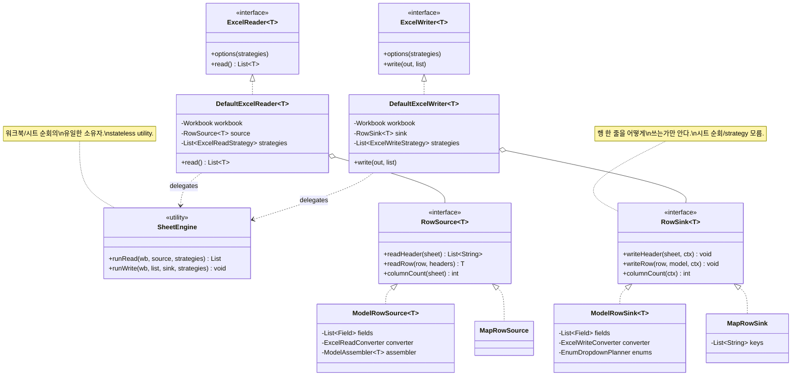

# Option C — SheetEngine + RowSink/RowSource

> **요약**: `AbstractExcelReader/Writer` **추상 클래스를 완전히 폐기**. 단일 `SheetEngine` 이 워크북 driver 역할을 맡고,
`ModelReader/Writer/MapReader/Writer` 는 `RowSource<T>`/`RowSink<T>` 인터페이스를 구현하는 **순수 로직 클래스** 가 됨. 인터페이스 + composition 만
> 남음.

---

## 1. 동기 — 현재 구조의 무엇을 해결하는가

| # | 현재 문제                                                                                            | 위치                                                           |
|---|--------------------------------------------------------------------------------------------------|--------------------------------------------------------------|
| 1 | 추상 클래스가 워크북 순회, 시트 생성, partitioning, 라이프사이클 hook, strategy 해석을 모두 책임 — God-class 경향              | `AbstractExcelWriter.java:128-187` (60 LOC 의 거의 모든 것이 다른 책임) |
| 2 | `protected readBodyAsMaps` 가 leaky abstraction — ModelReader 와 MapReader 가 같은 helper 의 다른 의미를 사용 | `AbstractExcelReader.java:215-232`                           |
| 3 | 추상이 `<T>` 를 carrier 로 보유하지만 Map 모드에서는 의미 없음 (`MAP_TYPE` 위장의 원인)                                  | `AbstractExcelReader.java:62`, `MapReader.java:40-52`        |
| 4 | mutable context 가 추상/구상 양쪽에서 변이 — ownership 불명, 검증 버그 발생                                         | `ExcelWriteContext.java:127` (sheet 검증 버그)                   |
| 5 | 라이프사이클 hook 이 강제됨 — 사용자가 hook 시점을 알아야 함                                                          | `ExcelReadLifecycle/ExcelWriteLifecycle`                     |

핵심 진단: **추상 클래스가 잘못 설계된 게 아니라, 추상 클래스 자체가 잘못된 도구다.** 워크북 순회는 객체가 아니라 함수다. Reader/Writer 는 "행을 어떻게 다루는가" 가 본질이지 "어떻게 시트를
순회하는가" 가 아니다. 두 책임을 분리하면 추상 클래스가 사라진다.

---

## 2. 핵심 아이디어 (한 줄)

> *"Excel reader/writer" 는 객체 정체성이 아니라 함수다.* `RowSource<T>`/`RowSink<T>` 가 행 단위 변환을 담당하고, `SheetEngine` 이 단 한 곳에서 워크북
> 순회를 한다.

---

## 3. 아키텍처 도표

### 3-1. 책임 재분배 (Before vs After)

```
[BEFORE — 3-level 상속]              [AFTER — composition only]

ExcelWriter (interface)              ExcelWriter (interface)
  └─ AbstractExcelWriter                ↑
      ├─ 워크북 순회                   ┌────────────────────┐
      ├─ 시트 생성/partition           │ DefaultExcelWriter │  ← 단 하나의 구상
      ├─ strategy 일부                 │ - SheetEngine      │
      ├─ lifecycle hooks               │ - RowSink<T>       │
      ├─ createBody (model 의존!)      │ - List<Strategy>   │
      └─ ModelWriter / MapWriter      └─────────┬──────────┘
          ├─ strategy 다른 일부                  │
          ├─ createHeader                  composes
          ├─ getColumnCount                       │
          └─ createCellValue            ┌─────────┴──────────┐
                                        ↓                     ↓
                                  SheetEngine            RowSink<T>
                                  (워크북 driver)         (행 변환만)
                                                            ↑
                                                   ┌────────┴────────┐
                                                   ↓                 ↓
                                              ModelRowSink<T>   MapRowSink
                                              (필드 변환)       (key 매핑)
```

### 3-2. 흐름도 (write 경로)

```
Javaxcel.writer(wb, MyDto.class)
    ↓
new DefaultExcelWriter<>(wb, ModelRowSink.forClass(MyDto.class, registry))
    ↓
.options(BodyStyles, HeaderStyles, Filter, ...)
    ↓
.write(out, list)
    ↓
SheetEngine.runWrite(wb, list, sink, strategies)
    ├─ partitionByMaxRows(list)
    ├─ resolveSheetNames()
    ├─ for each chunk:
    │   ├─ createSheet
    │   ├─ sink.writeHeader(sheet, ctx)   ← 모드별 분기 (단 한 곳)
    │   ├─ for each row in chunk:
    │   │     sink.writeRow(sheet, row, model)
    │   ├─ applyStrategies(sheet, strategies)
    │   └─ done
    ├─ save / close
    └─ return
```

`SheetEngine` 은 `RowSink` 가 model 인지 map 인지 모르며, model 에 어떤 어노테이션이 붙는지도 모름. **워크북 순회와 행 변환이 직교 분리**.

---

## 4. 클래스 다이어그램



핵심:

- 추상 클래스 **0개**.
- 다형성 축이 둘로 분리: `RowSource/Sink` (행 변환) ↔ `Strategy` (sheet 후처리).
- `SheetEngine` 은 stateless utility — 함수의 묶음.

---

## 5. 패키지 구조

```
core/src/main/java/com/github/javaxcel/core/
├── Javaxcel.java                              ⚙ 변경 — facade 가 새 경로 호출
├── annotation/                                ⚪ 불변
├── converter/                                 ⚪ 불변
├── engine/                                    ➕ 신규 디렉토리
│   ├── SheetEngine.java                       ➕ stateless utility (~120 LOC)
│   ├── RowContext.java                        ➕ 시트 단위 immutable 컨텍스트
│   └── strategy/StrategyApplier.java          ➕ AutoResize/HiddenExtra/Filter 적용기
├── in/
│   ├── ExcelReader.java                       ⚪ 불변
│   ├── DefaultExcelReader.java                ➕ ~50 LOC, 단일 구상
│   ├── source/
│   │   ├── RowSource.java                     ➕ 신규 인터페이스
│   │   ├── ModelRowSource.java                ➕ 현 ModelReader 의 행 변환 흡수
│   │   └── MapRowSource.java                  ➕ 현 MapReader 의 행 변환 흡수
│   ├── strategy/                              ⚪ 불변
│   └── context/ExcelReadContext.java          ⚙ immutable 로 재설계
└── out/
    ├── ExcelWriter.java                       ⚪
    ├── DefaultExcelWriter.java                ➕
    ├── sink/
    │   ├── RowSink.java                       ➕
    │   ├── ModelRowSink.java                  ➕
    │   └── MapRowSink.java                    ➕
    ├── strategy/                              ⚪
    └── context/ExcelWriteContext.java         ⚙

# 제거 대상 (전부 삭제)
- in/core/AbstractExcelReader.java                         ❌
- in/core/impl/ModelReader.java                            ❌ (ModelRowSource 로 대체)
- in/core/impl/MapReader.java                              ❌ (MapRowSource 로 대체)
- in/lifecycle/ExcelReadLifecycle.java                     ❌
- out/core/AbstractExcelWriter.java                        ❌
- out/core/impl/ModelWriter.java                           ❌ (ModelRowSink 로 대체)
- out/core/impl/MapWriter.java                             ❌ (MapRowSink 로 대체)
- out/lifecycle/ExcelWriteLifecycle.java                   ❌
```

---

## 6. 핵심 코드 스케치

### 6-1. RowSink 인터페이스

```java
public interface RowSink<T> {
    /** 시트 헤더 생성 */
    void writeHeader(Sheet sheet, RowContext ctx);

    /** 한 행 작성 */
    void writeRow(Row row, T model, RowContext ctx);

    /** 컬럼 개수 (style/filter strategy 가 사용) */
    int columnCount();

    /** 사전 분석 (현 prepare 단계) */
    default void prepare(RowContext ctx) {
    }
}
```

### 6-2. SheetEngine — stateless utility

```java
public final class SheetEngine {

    public static <T> List<T> runRead(
            Workbook wb,
            RowSource<T> source,
            Map<Class<?>, ExcelReadStrategy> strategies) {
        int limit = StrategyResolver.limit(strategies).orElse(-1);
        List<T> all = new ArrayList<>();
        for (Sheet sheet : ExcelUtils.getSheets(wb)) {
            if (all.size() == limit)
                break;
            List<String> headers = source.readHeader(sheet);
            int read = 0;
            for (Row row : sheet) {
                if (row.getRowNum() == 0)
                    continue;            // skip header
                if (all.size() == limit)
                    break;
                all.add(source.readRow(row, headers));
                read++;
            }
        }
        return Collections.unmodifiableList(all);
    }

    public static <T> void runWrite(
            Workbook wb, List<T> list, RowSink<T> sink, OutputStream out,
            Map<Class<?>, ExcelWriteStrategy> strategies) {
        int maxRows = ExcelUtils.getMaxRows(wb) - 1;
        List<List<T>> chunks = CollectionUtils.partitionBySize(list, maxRows);
        List<String> sheetNames = SheetNamePlanner.plan(strategies, chunks.size());

        for (int i = 0; i < chunks.size(); i++) {
            Sheet sheet = wb.createSheet(sheetNames.get(i));
            RowContext ctx = RowContext.of(wb, sheet, chunks.get(i), strategies);
            sink.prepare(ctx);
            sink.writeHeader(sheet, ctx);
            int rowIdx = 1;
            for (T model : chunks.get(i)) {
                Row row = sheet.createRow(rowIdx++);
                sink.writeRow(row, model, ctx);
            }
            StrategyApplier.applyPostSheet(sheet, sink.columnCount(), strategies);
        }
        WorkbookSaver.save(wb, out, strategies);
    }
}
```

`SheetEngine` 은 lifecycle hook 을 노출하지 않음. 필요한 외부 confiugration 은 모두 `RowSink/RowSource` 의 메서드 또는 strategy 로 전달됨.

### 6-3. DefaultExcelWriter (현 `AbstractExcelWriter` ~400 LOC → ~40 LOC)

```java
public final class DefaultExcelWriter<T> implements ExcelWriter<T> {
    private final Workbook workbook;
    private final RowSink<T> sink;
    private Map<Class<? extends ExcelWriteStrategy>, ExcelWriteStrategy> strategies =
            Collections.emptyMap();

    public DefaultExcelWriter(Workbook wb, RowSink<T> sink) {
        this.workbook = wb;
        this.sink = sink;
    }

    @Override
    public final ExcelWriter<T> options(ExcelWriteStrategy... s) {
        this.strategies = StrategyDedup.collect(s);
        return this;
    }

    @Override
    public final void write(OutputStream out, List<T> list) {
        SheetEngine.runWrite(workbook, list, sink, out, strategies);
    }
}
```

### 6-4. ModelRowSink (현 ModelWriter 의 모든 model-aware 로직 흡수)

```java
public final class ModelRowSink<T> implements RowSink<T> {
    private final List<Field> fields;
    private final ExcelTypeHandlerRegistry registry;
    private ExcelWriteConverter converter;          // prepare 에서 초기화
    private CellStyle[] headerStyles, bodyStyles;
    private Map<Integer, String[]> enumDropdowns;

    public static <T> ModelRowSink<T> forClass(Class<T> type, ExcelTypeHandlerRegistry reg) { ...}

    @Override
    public void prepare(RowContext ctx) {
        // 현 ModelWriter.prepare() 의 모든 로직 (analyzer + style + dropdown) 가 여기로
        ExcelWriteAnalyzer ra = new ExcelWriteAnalyzer(registry);
        List<ExcelAnalysis> analyses = ra.analyze(fields, ctx.strategies().values().toArray());
        this.converter = new ExcelWriteConverters(analyses, registry);
        this.headerStyles = StyleResolution.headerStyles(ctx, fields);
        this.bodyStyles = StyleResolution.bodyStyles(ctx, fields);
        this.enumDropdowns = EnumDropdownPlanner.plan(fields, ctx);
    }

    @Override
    public void writeHeader(Sheet sheet, RowContext ctx) {
        Row row = sheet.createRow(0);
        List<String> names = HeaderNameResolver.resolve(ctx, fields);
        for (int i = 0; i < names.size(); i++) {
            Cell cell = row.createCell(i);
            cell.setCellValue(names.get(i));
            if (headerStyles[i] != null)
                cell.setCellStyle(headerStyles[i]);
        }
    }

    @Override
    public void writeRow(Row row, T model, RowContext ctx) {
        for (int j = 0; j < fields.size(); j++) {
            String value = converter.convert(model, fields.get(j));
            if (!StringUtils.isNullOrEmpty(value)) {
                Cell c = row.createCell(j);
                c.setCellValue(value);
                if (bodyStyles[j] != null)
                    c.setCellStyle(bodyStyles[j]);
            }
        }
    }

    @Override
    public int columnCount() {
        return fields.size();
    }
}
```

### 6-5. Javaxcel facade (변화 최소화)

```java
public final class Javaxcel {
    public <T> ExcelWriter<T> writer(Workbook wb, Class<T> type) {
        return new DefaultExcelWriter<>(wb, ModelRowSink.forClass(type, registry));
    }

    public ExcelWriter<Map<String, Object>> writer(Workbook wb) {
        return new DefaultExcelWriter<>(wb, new MapRowSink());
    }

    public <T> ExcelReader<T> reader(Workbook wb, Class<T> type) {
        return new DefaultExcelReader<>(wb, ModelRowSource.forClass(type, registry));
    }

    public ExcelReader<Map<String, String>> reader(Workbook wb) {
        return new DefaultExcelReader<>(wb, new MapRowSource());
    }
}
```

**`MAP_TYPE` 위장 자연 소멸**: `MapRowSink` 는 `Class<Map<…>>` 가 필요 없음 — 그냥 sink.

---

## 7. 마이그레이션 단계

### Phase 1 — 인프라 (기존 코드와 병존)

1. `engine/SheetEngine`, `RowContext`, `StrategyApplier` 추가.
2. `RowSource<T>`, `RowSink<T>` 인터페이스 추가.
3. **기존 `Abstract*`/`Model*`/`Map*` 보존** — 새 코드는 옆에 추가.

### Phase 2 — `RowSink/RowSource` 구현

4. `ModelRowSink<T>` 작성: 현 `ModelWriter` 의 prepare/createHeader/createCellValue 흡수.
5. `MapRowSink` 작성: 현 `MapWriter` 의 prepare/createHeader/createCellValue 흡수.
6. `ModelRowSource<T>`, `MapRowSource` 동일하게.
7. `DefaultExcelReader/Writer` 작성.

### Phase 3 — Strategy 응용기

8. `StrategyApplier` 가 `AutoResizedColumns/HiddenExtra*/Filter` 적용 책임 흡수.
9. `BodyStyles/HeaderStyles` 는 `ModelRowSink/MapRowSink.prepare` 에서 호출하는 `StyleResolution` 헬퍼로 단일화 (Option B 와 동일한 효과).

### Phase 4 — Cutover (PR 한 번에 일어남)

10. `Javaxcel.facade` 메서드들이 `DefaultExcel*` 로 분기.
11. 회귀 테스트 전부 통과 확인.
12. **deprecation cycle**: `AbstractExcelReader/Writer` 와 `ModelReader/MapReader/ModelWriter/MapWriter`,
    `ExcelRead/WriteLifecycle` 에 `@Deprecated(forRemoval = true)` 부착, 다음 메이저에 제거 안내.

### Phase 5 — 다음 메이저

13. deprecated 클래스 일괄 제거.
14. `MAP_TYPE` 자동 소멸 확인.

---

## 8. Tradeoffs

| 측면                          | 평가                                                                                                 |
|-----------------------------|----------------------------------------------------------------------------------------------------|
| **추상 계층 단순도**               | ✅ 셋 중 **가장 깨끗** — 추상 클래스 0개, lifecycle interface 0개                                                |
| **strategy 중복**             | ✅ `StyleResolution` 한 곳, `RowSink` 가 column count 만 노출                                             |
| **mutable context**         | ✅ `RowContext` 가 immutable — 변이 owner 명확                                                           |
| **`MAP_TYPE` 위장**           | ✅ 자연 소멸 (Class<T> 매개변수 자체가 사라짐)                                                                    |
| **테스트 용이성**                 | ✅ `RowSink/Source` 는 순수 함수 단위로 단위테스트 쉬움                                                            |
| **public API 호환성**          | ✅ `Javaxcel`, `ExcelReader/Writer` 인터페이스 불변                                                        |
| **internal API 호환성**        | ❌ `Abstract*` 상속 사용자 코드 영향 (deprecation cycle 필요)                                                  |
| **lifecycle hook 호환성**      | ❌ `prepare/preReadSheet/postReadSheet/complete` 노출이 사라짐. 외부 사용자가 hook 에 의존했다면 깨짐. (실제 사용 빈도 조사 필요) |
| **마이그레이션 비용**               | 🔴 중상 — Phase 1~4 가 사실상 새 모듈 작성. Phase 5 의 cleanup 까지 메이저 사이클 필요                                   |
| **개념 학습 비용**                | ⚠ `Source/Sink/Engine` 새 어휘 도입                                                                     |
| **deprecation cycle 운영 부담** | ⚠ 두 경로 한동안 공존                                                                                      |

---

## 9. Option A/B 와의 관계

| 측면                | Option A                   | Option B        | Option C                |
|-------------------|----------------------------|-----------------|-------------------------|
| 추상 계층             | 폐기 (descriptor)            | 유지 (dispatcher) | 폐기 (sink/source)        |
| 다형성 축             | `ColumnDescriptor` (컬럼 단위) | `Stage` (단계 단위) | `RowSink/Source` (행 단위) |
| 마이그레이션 비용         | 高                          | 低               | 中-高                     |
| `MAP_TYPE` 해결     | ✅                          | ⚠ 별도 처리         | ✅                       |
| lifecycle hook 호환 | ❌                          | ✅               | ❌ (deprecation)         |
| public API 영향     | 0                          | 0               | 0                       |
| 장기 유지보수성          | ✅✅                         | ✅               | ✅✅                      |

**Option C 와 [Option A](option-a-column-descriptor.md) 는 사실상 같은 방향의 다른 단면**: A 는 "컬럼 단위" 추상화, C 는 "행 단위 + 시트 엔진" 추상화. 둘을
결합할 수도 있음 — `RowSink` 가 `List<ColumnDescriptor>` 를 보유하는 형태.

---

## 10. 한 줄 결론

> **이상적이지만 비싸다.** 라이프사이클 hook 호환성을 깨야 하므로 메이저 버전 업그레이드 시점에만 합리적. 지금 도입할 옵션은 아님 — [Option B](option-b-stage-pipeline.md)
> 로 가다가 시기가 되면 **B → C** 로 자연 진화하거나 **B → A** 로 갈 수 있음.
